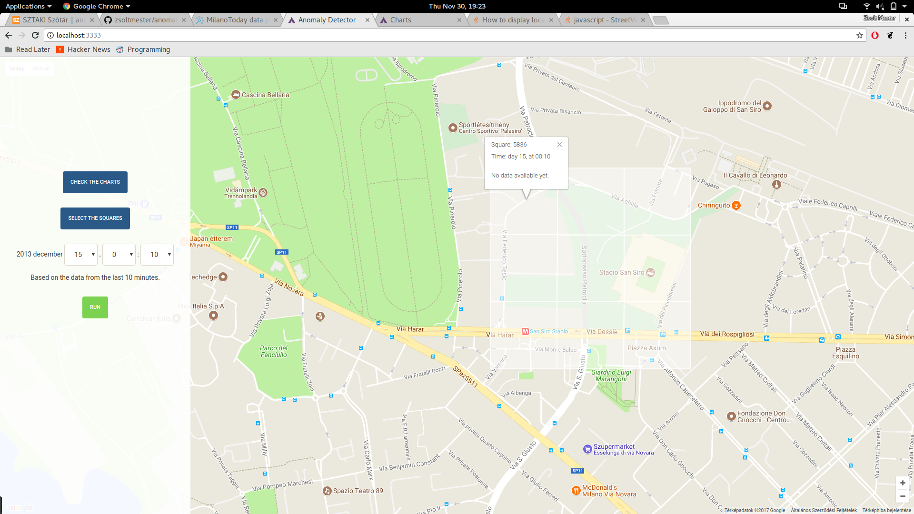
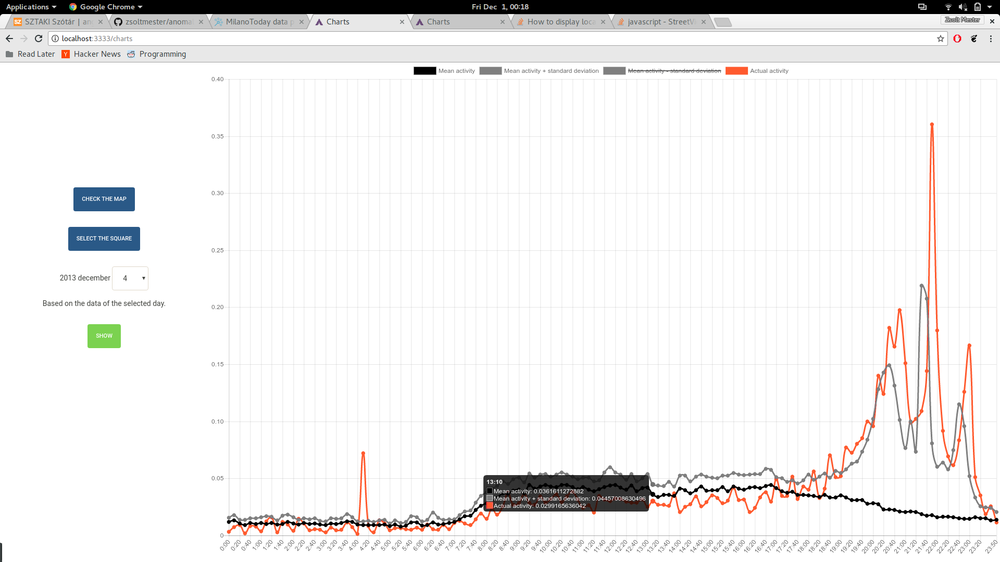

# Bevezetés

A fejlett országokban az emberek többsége rendelkezik már telefonnal. Telefonálhívást kezdeményeznek vagy fogadnak, üzenetet írnak vagy fogadnak, illetve fekapcsolódnak az internetre. Ezeket az eseményeket a telekommunikációs szolgáltatók naplózzák, illetve időbélyeggel és a georáfiai hely információval látják el. Ezeket CDR-nek, azaz Call Detail Record-nak nevezzük.
A naplókat nagy méretű adatbázisoknak kell elképzelni, amibe minden CDR bekerül. A nagy méretű adatbázisok tárolására és elérésére használt algoritmusok és rendszerek az útóbbi időben sokat fejlődtek (ez a *big data* témaköre). Ezeknek a nagy méretű adatbázisoknak az elemzését segítik a mesterséges tanulásban elért eredmények.
Ez utóbbit használom a dolgozatomban arra, hogy egy nagy méretű adatbázist elemezve megtaláljam az események közt az anomáliákat. Ilyen lehet egy sport rendezvény, egy koncert, egy tüntetés, stb. Egy ilyen alkalmazás segíthet a rendőrségnek és a mentő szolgálatoknak spontán kialakuló tömegek azonosításában és a kapcsolódó eseményekre / vészhelyzetekre való felkészülésében.
2014 elején a Telecom Italia egy versenyt hírdetett *big data* témakörben, melynek keretében közzétette a 2013 novemberében és decemberében Milánóban készült CDR-eket. Az adatok anonimizáltak, így a CDR-ek segítségével nem azonosíthatók be a  szolgáltató ügyfelei. Ezt az adathalmazt fogom elemezni a dolgozatomban és ezekkel az adatokkal szimulálom a valós időben beérkező adatfeldogozását is.

# Felhasználói dokumentáció

Az Anomaly Detector egy webalkalmazás, amivel anomáliákat lehet keresni Milánóban, 2013 decemberéből. Az anomáliákat a Telecom Italia telekommunikációs eseményei elemzésével határozza meg. Az alkalmazással valós idejű adatfeldolgozást is lehet szimulálni.
Az alkalmazás alkalmi használatra ajánlott. Azoknak lehet hasznos, akik kíváncsiak arra, hogy egy adott 2013 decemberi esemény Milánóban mennyire befolyásolta az emberek mobiltelefon használati szokásait. Például egy sport esemény vagy egy színházi előadás. Esetleg kimutatható-e anomália az eseményhez köthetően. Azok számára is érdekes lehet ez az alkalmazás, akik szeretnék jobban megismerni a mobilhasználati szokásokat Milánóban. Rendszeres használatra nem ajánlott, hisz nem tartalmaz ezt ösztönző funkciót, mint például valós időben beérkező adatok elemzése és vizualizálása. De azoknak, akiknek egy ilyen szoftver hasznos lenne (rendfenntartó szervek, mentő szolgálat vagy maga a telekommunikációs vállalat), láthatnak egy példát, hogy milyen eredménnyel lehetne anomáliákat detektálni egy hasonló adathalmazban, ha ők azt valós időben feldogoznák.
A webalkalmazás nem igényel semmilyen egyéb hardvert vagy szoftvert, mint amit a böngésző ajánlj. Fejlesztve és tesztelve 62-es Google Chrome és 57-es Firefox böngészőkkel lett. A térkép betöltése és frissítése viszont nagyban függ az internetkapcsolat sebességétől. Illetve egy nagy felbontású képernyő segíthet a grafikonok elemzésében.
A webalkalmazás indításához csak a weboldalt kell betölteni egy böngésző segítségével. A javascript kódok futtatását engedélyezni kell, ha azok ki lennének kapcsolva.

## Az alkalmazás funkcióinak bemutatása

### Szimulációs oldal

A weboldalt betöltve a következő képernyő fogad:

Ezen az odalon lehet szimulációt indítani, a kiválasztott kezdő dátummal és területtel.
A képernyő egészét elfoglalja a térkép. A térképet hasonlóan lehet mozgatni, mint egy Google Maps-et: egérrel húzogatható, és dupla kattintással, egér görgővel és a jobb alsó sarokban lévő gombokkal közelíthető / távolítható.
Bal oldalon található a menü, aminek fehér háttere kicsit áttetsző. A legfelső gomb (*CHECK THE CHARTS*) a grafikon nézegető képernyőre visz el, amiről a következő fejezetben lesz szó. A következő gomb, a *SELECT THE SQUARES*, a terület kiválasztó oldalra visz el, amiről szintén később lesz szó. A gomb alatt lévő sorban a dátumot válaszhatjuk ki: december egy tetszőleges napját és óráját, illetve 0, 10, 20, 30, 40 vagy 50 percet. A menü alján lévő zöld *RUN* gombal indítható a szimuláció. Amíg a szimuláció fut, addig a zöld *RUN* gombot egy piros *STOP* gomb cseréli le, ami alatt kékkel tájékoztató üzenetek jelennek meg:

A szimuláció indításakor a kiválasztott területek négyzetei is megjelennek a térképen, fehérrel színezve. A négyzetekre kattintva megjelenik egy információs ablak, amiben még csak a terület azonosítója és az időpont látható:

Az indítás után az időpont és a terület nem módosítható, csak leállítás után. A szimuláció egy lépése a következőkből áll:
1. Beállíjuk, hogy mikor érkeztek be az adatok. Ilyenkor a *Processing data...* üzenet jelenik meg a menü alján.
2. Feldolgozzuk és elemezzük az adatokat. Az eddig megjelenített üzenet a menüben nem változik.
3. Megjelenítjük az eredményt a térképen. Az eddig megjelenített üzenet a menüben nem változik. Viszont a térképen a területek színe megváltozik egy, a teljesen átlátszó piros és az átlátszatlan piros szín közti állapotra. **A szín erőssége jelzi, hogy mekkora eséllyel történt anomália a környéken.**

Az információs ablakban ekkor a következők jelennek meg:
	- A terület azonosítója, ami egy 1 és 10000 közti egész szám.
	- Az anomália valószínűsége. Ez egy pozitív valós szám, aminek **értéke 1-nél is nagyobb lehet**. Ez az érték felel meg a négyzet színének. Ha az érték 0, akkor a négyzet teljesen átlátszó, ha 1, vagy annál nagyobb, akkor teljesen piros.
	- Az aktuális aktivitás értéke, ami egy pozitív valós szám.
	- A novemberi átlagos aktivitás értéke, ami egy pozitív valós szám.
	- A novemberi aktivitás szórása, ami egy pozitív valós szám.
4. Várunk a következő adathalmaz érkezésére. A tájékoztató üzenet a következőre változik: *Waiting for the next pack of data...*. Az alkalmazás azt szimulálja, hogy 10 percenként érkeznek be az adatok, de nem vár ennyit, különben használhatatlanul lassú lenne a szimulációs mód.
A szimuláció addig fut, még azt le nem állítjuk, vagy el nem fogynak az adatok (azaz december 31, 23:50-ig tud futni). A szimuláció bármikor megállítható.

Hiba esetén a következő tájékoztató szöveg jelenik meg: *Something unexpected happened.*, és leáll a szimuláció.

#### Példa használat

Válassza ki a San Siro stadiont:

Válassza ki december elsejét és délután 5 órát, majd indítsa el a szimulációt. Kezdetben ezt fogja:

Majd eljut eddig:

Nyomja meg a *STOP* gombot.
Ezen a napon egy Inter - Sampdoria focimeccs volt, ami délután 5 körül ért véget. Látni, hogy a tömeg körülbelül 1 óra alatt vonult el a környékről.

### Grafikon elemző oldal

Ide akkor juthat, ha a szimulációs oldal menüjében megnyomta a *CHECK THE CHARTS* gombot. Az oldal kezdetben így néz ki:

Ezen a képernyőn lehet grafikonon megnézni hogy az adott napon és az adott területen milyen volt:
- az adott napi aktivitás, (narancs vonal)
- a novemberi átlagos aktivitás, (fekete vonal)
- a novemberi átlagos aktivitás és a novemberi szórás összege, (szürke vonal)
- a novemberi átlagos aktivitás és a novemberi szórás különbsége. (ez is szürke vonal)

A képernyő jobb oldalát egy grafikon foglalja el, a bal oldalát pedig egy menü.
A menü első gombja (*CHECK THE MAP*) a szimulációs oldalra visz. A második gomb (*SELECT THE SQUARE*) a terület kiválasztó oldalra (erről majd a következő fejezetben lehet olvasni). A második gomb alatti sorban a dátumot lehet kiválasztani, mégpedig 2013 december egy tetszőleges napját. A menü alján a zöld *SHOW* gombbal lehet lekérni a grafikont. A lekérés közben a *SHOW* gomb alatt egy kék tájékoztató szöveg jelzi, hogy dolgozik az oldal: *Processing data...*.
A grafikon vízszintes tengelye az időt reprezentálja: 00:00-tól 23:50-ig, 10 perces bontásban. A függőleges tengely az aktivitásnak felel meg, ami egy pozitív valós szám lehet. A grafikon tetején a vonalak címe és a hozzájuk tartozó szín található. A címükre kattintva ki-be kapcsolhatóak a vonalak. A második szürke vonal kezdetben ki van kapcsolva. A grafikonon mozgatva az egeret minden időpontra képes megjelennek a vonalak pontos értékei:

Hiba esetén a következő tájékoztató szöveg jelenik meg: *Something unexpected happened.*.

#### Példa beállítás

Válassza ki a San Siro stadiont:

Válassza ki december elsejét és nyomja meg a *SHOW* gombot. Ekkor ezt fogja látni:

Azt látni, a délután 3 órakor kezdődő Inter - Sampdoria focimeccs előtt, a szünetben és a meccs után kiugró volt az aktivitás (naracssárga vonal). A novemberi átlagból azt is látszik, hogy a legtöbb novemberi meccs este 8-kor kezdődött. Ezért ilyen kiugró az átlag és a szórás.

### Terület kiválasztó oldal

Ide akkor juthat, ha a főoldalon vagy a grafikon elemző oldalon a *CHECK THE SQUARE(S)* gombokra kattintott. Az oldalnak két állapota van, attól függően, hogy a szimulációs oldalról vagy a grafikon elemző oldalról jött ide. A képernyő, ha a főoldalról jött ide, kezdetben így néz ki:

A képernyő, ha a grafikon elemző oldalról jött ide, kezdetben így néz ki:

Ezen az oldalon választhatjuk ki azokat a területeket, amiket elemezni akarunk a szimulációban vagy a grafikonokon. **Szimuláció esetén több terület is kiválasztható (akár az összes, de legalább 1), grafikon esetén viszont csak pontosan 1.**
A térképen hasonlóan mozoghatunk, mint a a szimulációs oldal térképén. A területeket kattintással jelölhetjük ki / törölhetjük ki a jelölést. A piros négyzetek a kijelölt négyzetek, a feketék a nem kijelöltek:

A kijelölés azonnal érvénybe lép, így egy vissza navigálás után, már ennek megfelően fog működni a szimuláció és ennek megfelelően jelennek meg az adatok a grafikonokon is.
